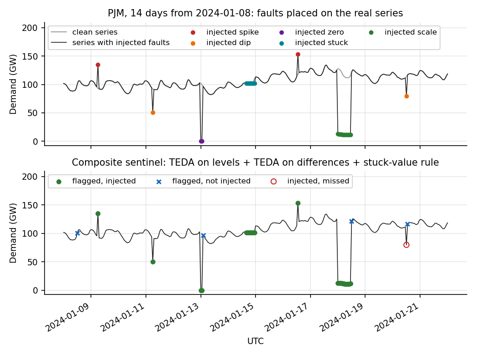
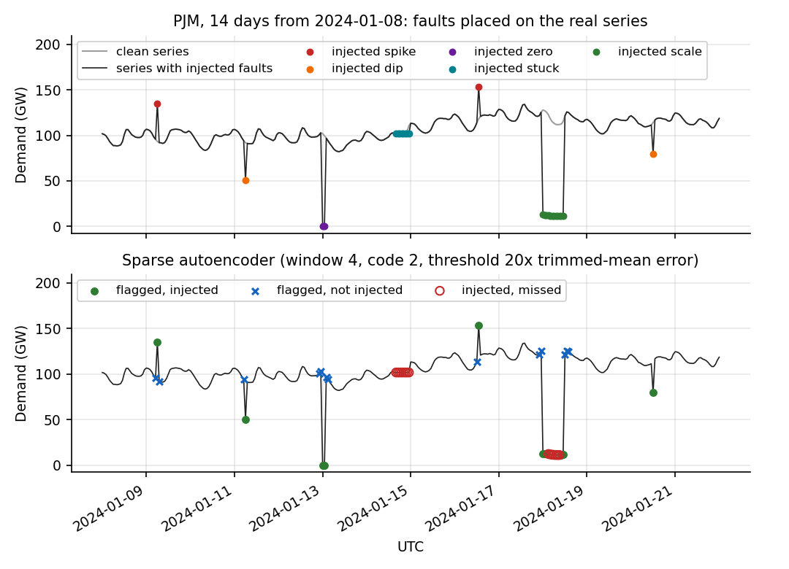
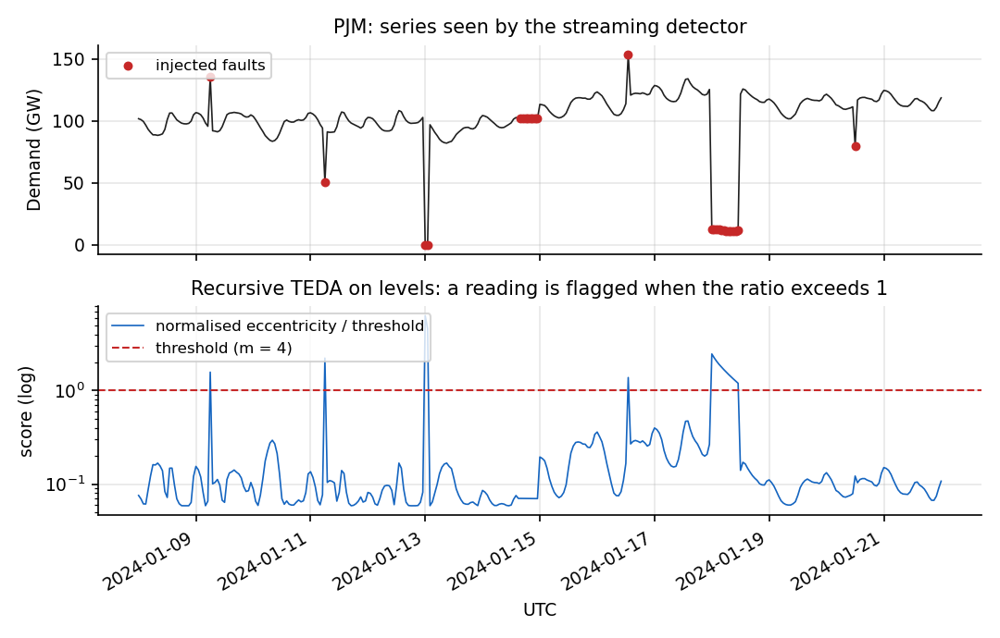
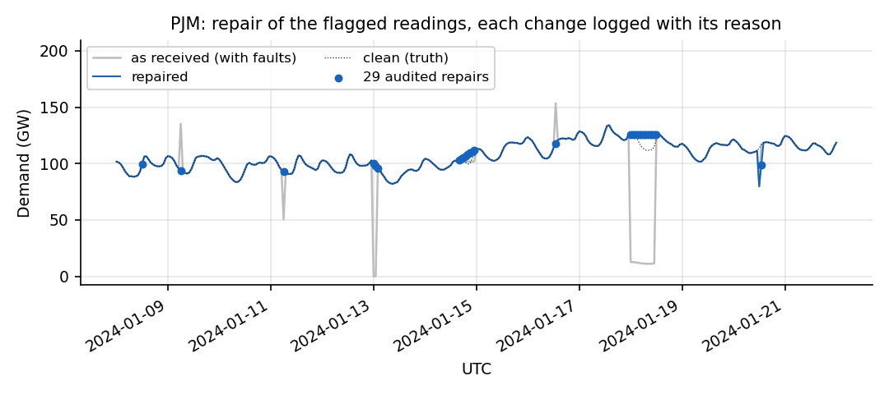
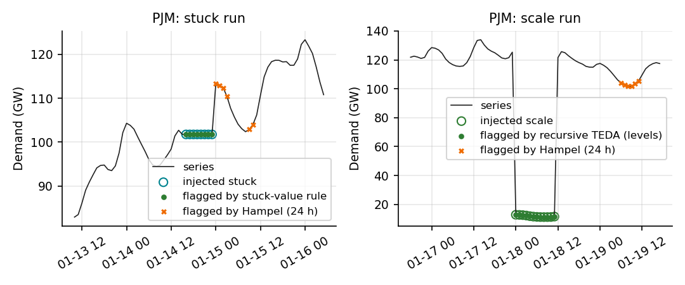
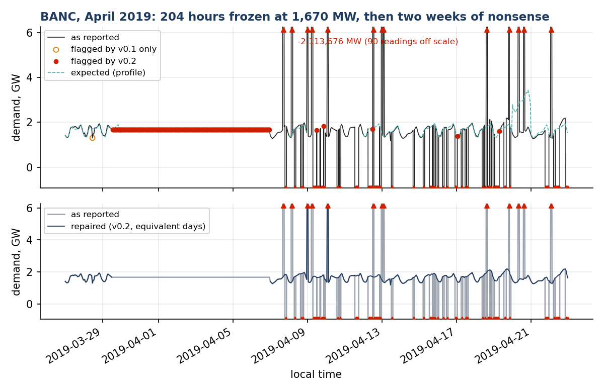
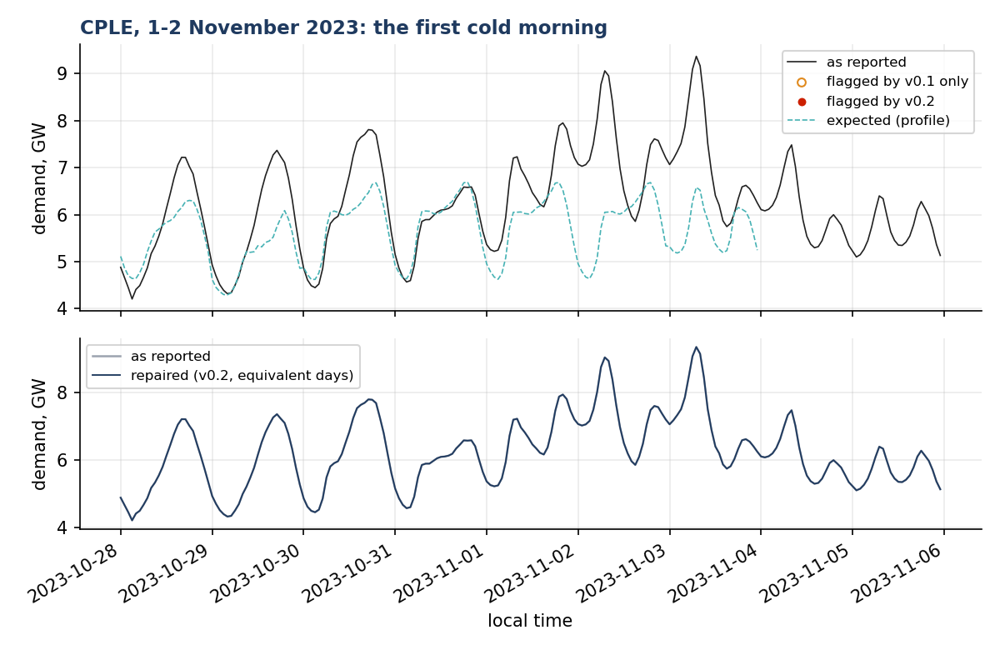

# Grid Data Sentinel

**Anomaly detection and repair for load telemetry, benchmarked on public data.**

During the January 2024 Arctic storms, FERC found operators flagging genuinely high load readings as "bad data" ([FERC 2024](https://www.ferc.gov/news-events/news/presentation-system-performance-review-january-2024-arctic-storms)). NERC lists data validation, anomaly detection and provenance as preconditions for trustworthy operator-facing AI ([NERC 2024](https://www.nerc.com/pa/rrm/bpsa/Documents/Whitepaper-AI%20and%20ML%20in%20Real-Time%20System%20Operations.pdf)). This package is a small, dependency-light toolkit for that problem: detect corrupted readings in a load series, repair them with an audit trail, and measure how well each method does on public EIA-930 data, both with known injected faults and on the faults the public record actually contains.

> Status: **v0.2.0** (batch mode). Streaming API and a weather-driven regime are on the roadmap below.

## Methods

| Detector | What it does | Origin |
|---|---|---|
| `RecursiveTEDA` | Streaming detector based on typicality and eccentricity data analytics: keeps a recursive mean and variance and flags a reading when its normalised eccentricity exceeds (m²+1)/2k. No window, no training, no distributional assumption. Runs on levels or on first differences; optional winsorised update (`robust=True`) so that a run of bad readings does not inflate the variance. | Angelov (2014); the maintainer's M.Sc. work on outlier detection in demand curves |
| `SparseAutoencoder` | Window autoencoder (default 4 readings, code of size 2, L1 activity penalty) trained to reconstruct the series; the reconstruction error is the anomaly score. Implemented in NumPy, so there is no deep-learning dependency. | Guerra Filho et al., [*Energies* 2024, 17(24), 6403](https://doi.org/10.3390/en17246403) |
| `stuck_values` | Rule: a run of identical consecutive readings is a frozen telemetry value, not a measurement. | Operational practice |
| `profile_residual` | Calendar-aware expectation: day types (workday, Saturday, Sunday, with the special days that behave like each) and an optional regime label; references are the last two weeks plus the same three weeks of the previous year; the residual is scaled by its recent MAD. The design follows [Cardinal Grid Note 2](https://github.com/cardinalgrid/notes), which tested the alternatives on 44 balancing authorities. | This package |
| `sentinel` | Composite v0.1: TEDA on levels ∪ TEDA on differences ∪ stuck-value rule. | This package |
| `sentinel_v2` | Composite v0.2: the v0.1 detectors, each flag kept only if the reading (or a neighbour) is also implausible against the profile; frozen runs, non-positive readings and gross ratios to the expected value (outside 1/3 to 3×) are kept without the check. | This package |
| `rolling_zscore`, `hampel`, `iqr`, `modified_zscore`, `relative_deviation` | Reference detectors, including the two rules most common in utility practice: the Iglewicz-Hoaglin modified z-score and a 15% deviation from a centred mean. | Standard |

Plus `inject_anomalies` (labelled spikes, dips, zeros, stuck runs and unit errors for benchmarking), `intervals_from_mask` (flags grouped into intervals with a duration class: up to 1 h, 1 day, 1 week, 1 month, more), `repair` (a straight line for gaps up to an hour; for longer gaps the mean of the same interval one or more weeks before and after, shifted to meet the neighbouring good readings; gaps longer than 48 readings are left open rather than invented; every change logged with its reason and method), `day_types` (U.S. calendar with special days) and `score_labels` (precision, recall, F1, MCC, with an optional ±n tolerance).

## In pictures

Two weeks of real PJM hourly demand from EIA-930 (January 2024) with seven faults placed on it: two spikes, two dips, a two-hour zero, an eight-hour frozen value and a twelve-hour unit error (×0.1). Generated by `scripts/make_figures.py`.



The v0.1 composite finds every fault except the milder dip (30% below the clean value at 12:00 UTC on 20 January, a level PJM has seen at that hour) and raises four false alarms on genuine steep ramps; the v0.2 confirmation against the profile is what removes those. The sparse autoencoder on the same window:



It catches the mild dip but not the frozen value, which reconstructs perfectly, and it flags the readings next to a fault as often as the fault itself. This is why the detectors are combined.

What the streaming detector computes, reading by reading, is one number against one threshold:



The repair step fills the flagged readings and logs every change with the original value, the new value, the reason and the method. Long gaps are left open rather than invented.



Two failure modes that window-based filters get wrong. On the left, a frozen value: the Hampel filter says nothing about the run and instead flags the ramp after it. On the right, a unit error lasting twelve hours: the Hampel filter, with its 24-hour window, sees the corrupted run as the new normal and flags the recovery.



## Real anomalies in the public record

Nothing needs to be injected to test the detectors: the EIA-930 demand series, as published, contain about 11,500 zero hours, 9,900 frozen hours, 5,800 hour-to-hour jumps of more than 2× and 2,600 unit-error hours across 6.5 million BA-hours. [docs/real_cases.md](docs/real_cases.md) has the survey by BA and a gallery of named cases with the flags of both composites and the repaired series, produced by `scripts/real_cases.py`. Two of them:



BANC reported the same 1,670 MW for 204 hours, then two weeks in which 80 hourly readings ranged from −2.1 million to +1.8 million MW on a system of about 1.7 GW. The v0.2 composite flags the frozen run through the stuck rule and the nonsense through the non-positive and gross-ratio rules, and the repair leaves the eight-day gap open, as it should.



The first cold morning of the season in the Carolinas: demand peaks at 7 a.m. for the first time since March, 45% above what a calendar profile expects. This is not a fault, and neither composite raises an alarm. A detector built on the profile alone would raise its loudest alarm of the year here, which is why the profile is used to confirm, never to accuse.

## Benchmark on EIA-930 with injected faults

Ten large balancing authorities, hourly demand for 2023 and 2024 from the EIA-930 balance files (via [ba-forecast-scorecard](https://github.com/cardinalgrid/ba-forecast-scorecard)), 0.5% of readings corrupted with labelled faults, every detector run on the corrupted series with its default settings.

<!-- results:start -->
Benchmark v0.2.0 run 2026-09-11: 20 BA-years (PJM, MISO, ERCO, CISO, SWPP, NYIS, ISNE, TVA, DUK, BPAT; 2023, 2024), 0.5% of readings corrupted, tolerance ±1 reading. Means over series.

| Detector | Precision | Precision (adj.) | Recall | F1 (adj.) | MCC | Spike | Dip | Zero | Stuck | Scale | s/series |
|---|---|---|---|---|---|---|---|---|---|---|---|
| Composite v0.2 (v0.1 detectors confirmed by the calendar profile) | 0.90 | 0.96 | 0.98 | 0.97 | 0.93 | 0.95 | 0.70 | 1.00 | 1.00 | 1.00 | 0.2 |
| Composite v0.1 (TEDA levels + TEDA differences + stuck rule) | 0.87 | 0.93 | 0.92 | 0.92 | 0.88 | 1.00 | 0.61 | 1.00 | 1.00 | 0.94 | 0.1 |
| Sparse autoencoder (window 4, code 2, factor 20) | 0.89 | 0.89 | 0.93 | 0.91 | 0.91 | 0.90 | 0.90 | 0.90 | 0.04 | 0.98 | 0.3 |
| Recursive TEDA (levels, m=4) | 0.97 | 0.98 | 0.82 | 0.89 | 0.89 | 0.60 | 0.21 | 1.00 | 0.00 | 0.93 | 0.0 |
| Recursive TEDA (levels, m=4, robust update) | 0.81 | 0.82 | 0.91 | 0.84 | 0.85 | 0.65 | 0.46 | 1.00 | 0.00 | 1.00 | 0.0 |
| Modified z-score (30 d, k=3.5) | 0.67 | 0.68 | 0.92 | 0.76 | 0.78 | 0.85 | 0.60 | 1.00 | 0.00 | 1.00 | 0.0 |
| Relative deviation from 5-h centred mean (15%) | 0.69 | 0.70 | 0.30 | 0.41 | 0.45 | 1.00 | 1.00 | 1.00 | 0.00 | 0.15 | 0.0 |
| Profile residual alone (day type, 2 weeks + last-year analogs, k=4) | 0.23 | 0.23 | 0.95 | 0.37 | 0.46 | 0.90 | 0.94 | 1.00 | 0.16 | 1.00 | 0.1 |
| Recursive TEDA (differenced, m=3) | 0.72 | 0.72 | 0.19 | 0.29 | 0.35 | 1.00 | 0.61 | 1.00 | 0.00 | 0.20 | 0.0 |
| Global IQR (k=1.5) | 0.17 | 0.17 | 0.93 | 0.27 | 0.38 | 0.60 | 0.78 | 1.00 | 0.10 | 1.00 | 0.0 |
| Rolling z-score (168 h, k=3) | 0.70 | 0.70 | 0.11 | 0.18 | 0.26 | 0.95 | 0.85 | 1.00 | 0.00 | 0.00 | 0.0 |
| stuck_rule | 0.46 | 0.55 | 0.06 | 0.11 | 0.16 | 0.00 | 0.00 | 0.00 | 1.00 | 0.01 | 0.0 |
| Hampel filter (24 h, k=3) | 0.07 | 0.07 | 0.20 | 0.10 | 0.11 | 0.95 | 0.72 | 1.00 | 0.08 | 0.15 | 0.0 |

Columns Spike to Scale are recall by anomaly type. Precision (adj.) and F1 (adj.) do not count as false alarms the flags on readings that the public series already had wrong (frozen runs, non-positive values, unit errors; see `docs/real_cases.md`); the plain precision does. Full table: `results/benchmark_by_series.csv`.
<!-- results:end -->

What the table says:

- **The v0.2 composite is the best detector on every count that matters**: adjusted precision 0.96 and recall 0.98, against 0.93 and 0.92 for v0.1; every fault type is caught, and dips, the weak spot of v0.1, go from 61% to 70%.
- **Plain precision understates both composites.** The source series already contain frozen runs and unit errors (see the survey above); a detector that flags them is right, but the injected-fault benchmark counts it as a false alarm. The adjusted columns exclude those readings from the denominator.
- **The autoencoder has the best recall on dips but misses frozen values**, which no reconstruction method sees: a frozen value is a perfectly reconstructable reading. The rule catches them all.
- **Reference detectors fail in the expected ways.** The global IQR rule flags every legitimate winter and summer peak; the Hampel filter and rolling z-score are blind to unit-error runs longer than their window; the modified z-score and the 15% rule, common in practice, sit in the middle.
- **The profile alone is not a detector.** With precision 0.23 it fires on every genuine departure from the calendar, first cold mornings included. As a confirmation of the level and difference detectors it is what lifts v0.2 above v0.1.

Defaults were chosen from sensitivity grids (`scripts/tune.py`, `results/tuning.csv`, and the v0.2 grid described in the changelog). The autoencoder threshold factor in particular is not portable across data: 3× the trimmed-mean error was right for 15-minute substation data in the 2024 paper; 20× is right for hourly BA data.

## Install and use

```bash
pip install git+https://github.com/cardinalgrid/grid-data-sentinel
```

```python
import pandas as pd
from grid_sentinel import sentinel_v2, repair, intervals_from_mask, summarize_intervals

demand = pd.read_csv("my_series.csv", index_col=0, parse_dates=True)["demand"]   # hourly, local time
flags = sentinel_v2(demand)                                   # value, score, expected, is_anomaly, confirmed_by
fixed, audit = repair(demand, flags["is_anomaly"], method="equivalent_days", reason="sentinel v0.2")
print(summarize_intervals(intervals_from_mask(flags["is_anomaly"])))
```

With a temperature regime (three classes from the daily mean temperature, °F), which Note 2 found to be worth more than any calendar distinction:

```python
from grid_sentinel import regime_from_temperature
regime = regime_from_temperature(daily_mean_temp_f)           # a Series indexed by day
flags = sentinel_v2(demand, regime=regime)
```

Command line:

```bash
grid-sentinel detect my_series.csv --column demand --method sentinel --repair --out detections.csv
grid-sentinel benchmark --tidy path/to/ba-forecast-scorecard/data/tidy --out results
python scripts/render_readme.py                                       # refresh the table above
python scripts/make_figures.py --tidy path/to/ba-forecast-scorecard/data/tidy   # the figures above
python scripts/real_cases.py --tidy path/to/ba-forecast-scorecard/data/tidy     # the survey and gallery
```

Streaming use of the TEDA detector, one reading at a time:

```python
from grid_sentinel import RecursiveTEDA
det = RecursiveTEDA(m=4.0)
for x in readings:
    r = det.update(x)
    if r.is_anomaly:
        ...
```

## Limitations

- The benchmark measures sensitivity to *injected* faults on top of series that already have faults of their own; the adjusted precision is the honest one, and it is still a benchmark on simple fault types (single-reading spikes and dips, zero runs, frozen values, ×10 and ×0.1 runs). Slow drift and partial feeder loss are not modelled yet.
- `RecursiveTEDA` keeps all history. On a decade of data the running variance is dominated by the seasonal cycle. The winsorised update protects it from bad runs, not from drift; a forgetting factor is planned.
- The profile's default regime is read from yesterday's load (morning peak or not). A temperature regime is better and can be passed in; the package does not download weather data.
- The composite is batch: `sentinel_v2` needs the whole series to build profiles. `RecursiveTEDA` is the only streaming component so far.
- One series, one BA, one detector at a time. No claims are made about any operator's internal data quality; the public record is what it is.

## Roadmap

| Version | Target | Scope |
|---|---|---|
| v0.1 | September 2026 | TEDA + autoencoder + rules, batch mode, benchmark on EIA-930 |
| v0.2 | September 2026 | Calendar-aware profile and confirmation, interval table, equivalent-day repair, practice baselines, survey and gallery of real anomalies (this release) |
| v0.3 | November 2026 | Streaming composite with forgetting, weather-driven regime, evaluation on the January 2024 Arctic-storm period |
| v1.0 | December 2026 | Audit trail format, documentation, examples on public data, PyPI |

## Development

```bash
pip install -e ".[dev]"
ruff check src tests scripts && pytest -q
```

## Citing

Guerra Filho, R. W. C. (2026). *Grid Data Sentinel: anomaly detection and repair for load telemetry with recursive TEDA, sparse autoencoders and calendar-aware profiles* (v0.2.0). Zenodo. https://doi.org/10.5281/zenodo.22726014 (concept DOI for all versions: 10.5281/zenodo.22726013). See `CITATION.cff`.

## License

Apache-2.0 for code; text and figures CC BY 4.0. Analyses rely on public data only and represent the maintainer's own views.
