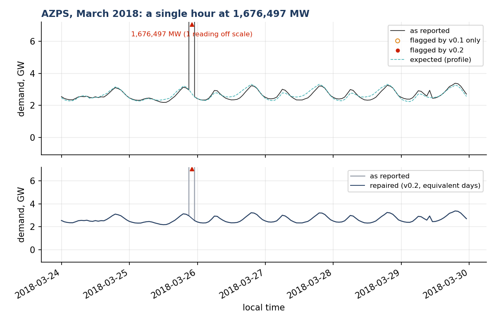
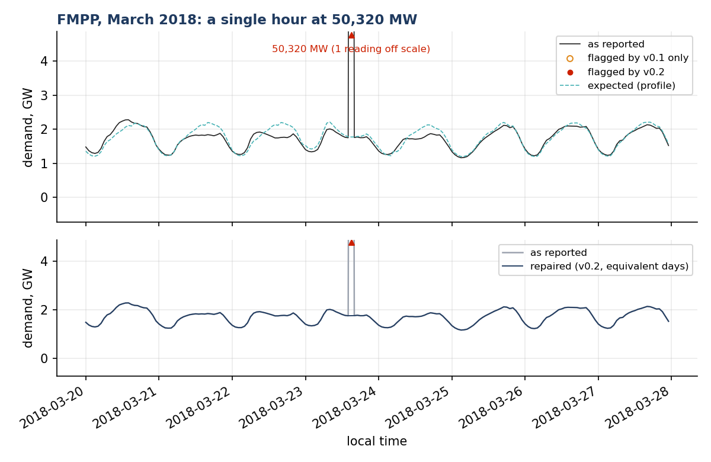
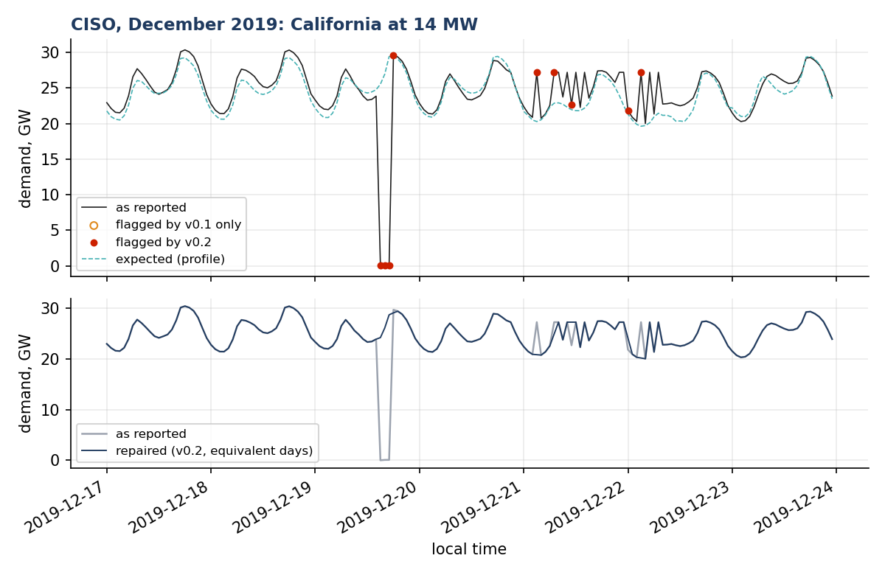
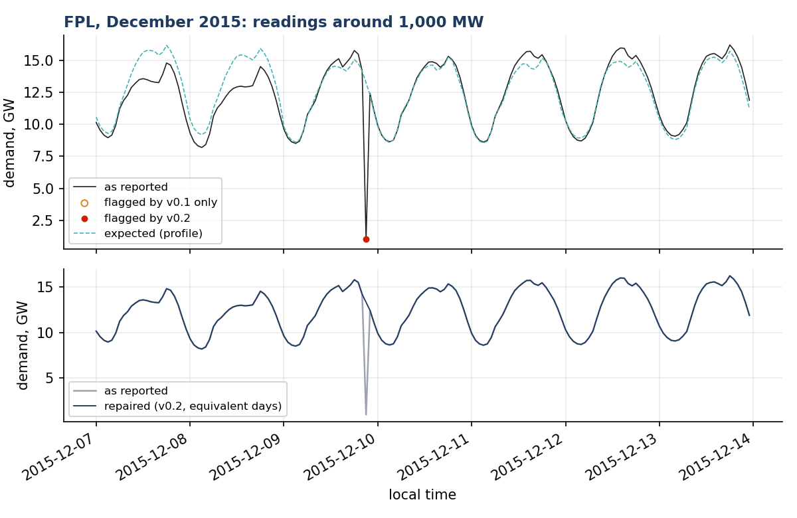
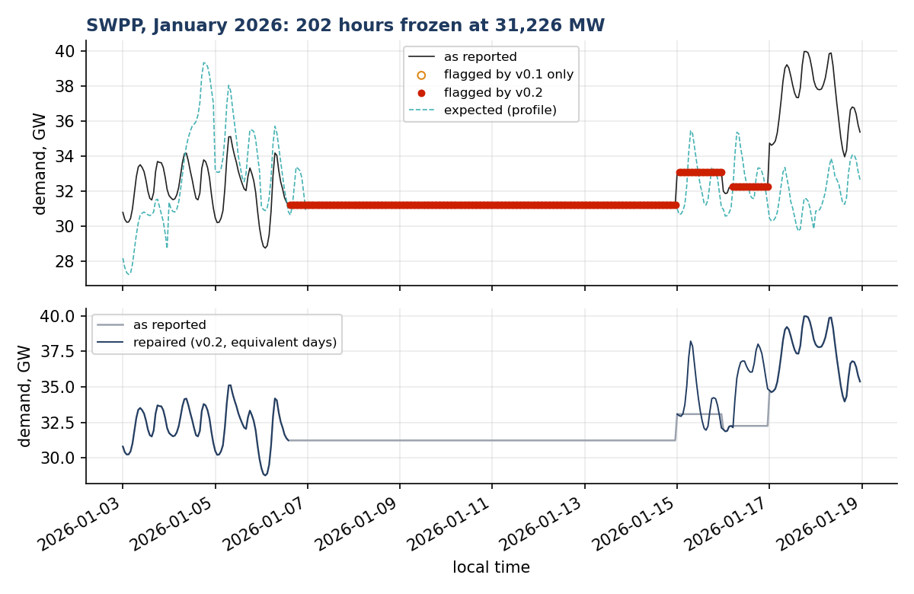
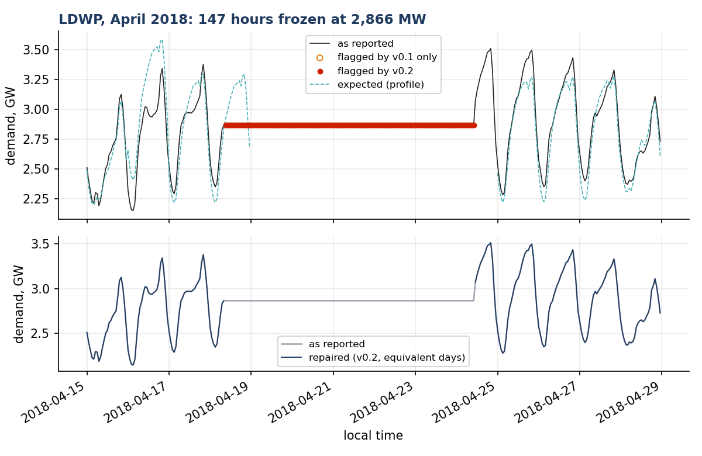
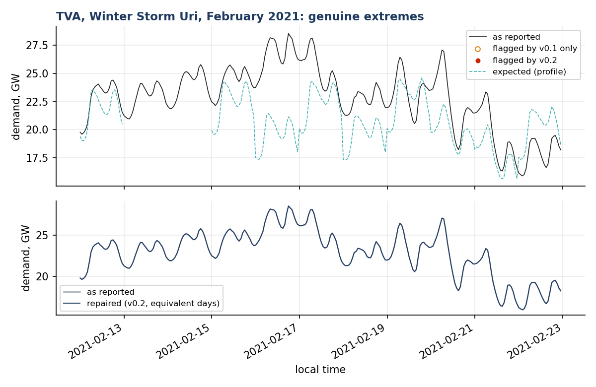

# Real anomalies in the EIA-930 demand record

Everything on this page comes from the public hourly demand that U.S. balancing authorities report to EIA, as published. Nothing was injected. The survey counts four simple signatures in the raw series of every BA; the gallery then shows named cases with the flags of the two composite detectors and the repaired series. The last two cases are genuine events, where the right answer is no alarm.

## Survey

BAs with at least 500 MW of mean demand (47 of 72), July 2015 to the latest file. A frozen run is three or more identical consecutive hourly values; a jump is an hour-to-hour ratio above 2 or below 1/2 between positive readings; a unit-error hour is a reading more than 5x or less than 1/5 of the two-week rolling median.

| BA | mean MW | zero hours | frozen runs | frozen hours | longest frozen run (h) | jumps | unit-error hours |
|---|---|---|---|---|---|---|---|
| PJM | 134,549 | 0 | 0 | 0 | 2 | 9 | 3 |
| MISO | 74,093 | 0 | 1 | 3 | 4 | 0 | 0 |
| ERCO | 46,604 | 0 | 0 | 0 | 2 | 0 | 0 |
| SWPP | 31,163 | 0 | 82 | 2919 | 273 | 4 | 2 |
| SOCO | 26,931 | 13 | 0 | 0 | 2 | 9 | 0 |
| CISO | 25,524 | 0 | 1 | 2 | 3 | 5 | 3 |
| TVA | 18,474 | 436 | 0 | 0 | 2 | 26 | 11 |
| NYIS | 17,570 | 15 | 2 | 4 | 3 | 0 | 0 |
| FPL | 15,340 | 58 | 0 | 0 | 2 | 39 | 13 |
| ISNE | 13,509 | 0 | 2 | 4 | 3 | 0 | 0 |
| DUK | 12,062 | 0 | 0 | 0 | 2 | 0 | 0 |
| CPLE | 6,998 | 1 | 0 | 0 | 2 | 4 | 0 |
| BPAT | 6,509 | 0 | 0 | 0 | 2 | 3 | 0 |
| FPC | 6,342 | 22 | 0 | 0 | 2 | 0 | 0 |
| PACE | 5,729 | 26 | 1 | 2 | 3 | 116 | 56 |
| PSCO | 5,185 | 15 | 0 | 0 | 2 | 42 | 146 |
| NEVP | 4,398 | 26 | 1 | 2 | 3 | 19 | 11 |
| LGEE | 4,148 | 3 | 1 | 2 | 3 | 4 | 1 |
| AZPS | 3,771 | 19 | 0 | 0 | 2 | 38 | 3 |
| SRP | 3,678 | 3 | 0 | 0 | 2 | 83 | 20 |
| WACM | 3,102 | 72 | 5 | 10 | 3 | 145 | 35 |
| PSEI | 3,080 | 0 | 1 | 2 | 3 | 4 | 1 |
| LDWP | 2,991 | 7 | 8 | 173 | 147 | 28 | 169 |
| SWPW | 2,869 | 0 | 3 | 1221 | 1042 | 0 | 0 |
| SC | 2,858 | 1 | 4 | 8 | 3 | 4 | 0 |
| SCEG | 2,791 | 0 | 5 | 10 | 3 | 7 | 3 |
| AECI | 2,547 | 0 | 2 | 4 | 3 | 0 | 0 |
| PACW | 2,542 | 41 | 5 | 11 | 4 | 81 | 64 |
| TEC | 2,502 | 3 | 1 | 2 | 3 | 0 | 0 |
| PGE | 2,466 | 0 | 6 | 12 | 3 | 10 | 1 |
| BANC | 2,247 | 235 | 5 | 211 | 204 | 188 | 77 |
| FMPP | 2,133 | 24 | 0 | 0 | 2 | 56 | 29 |
| IPCO | 2,032 | 0 | 5 | 10 | 3 | 6 | 0 |
| PNM | 1,626 | 48 | 7 | 14 | 3 | 3 | 0 |
| TEPC | 1,592 | 1 | 4 | 53 | 48 | 22 | 5 |
| JEA | 1,519 | 0 | 8 | 16 | 3 | 4 | 0 |
| AVA | 1,441 | 3 | 11 | 22 | 3 | 20 | 18 |
| NWMT | 1,342 | 77 | 23 | 46 | 3 | 38 | 23 |
| SEC | 1,261 | 9263 | 89 | 179 | 4 | 1795 | 1605 |
| WALC | 1,107 | 45 | 14 | 30 | 5 | 196 | 96 |
| SCL | 1,089 | 35 | 26 | 52 | 3 | 62 | 28 |
| EPE | 1,001 | 24 | 13 | 28 | 4 | 12 | 1 |
| BHBA | 865 | 0 | 0 | 0 | 2 | 0 | 0 |
| GCPD | 653 | 0 | 294 | 616 | 5 | 0 | 0 |
| CPLW | 566 | 0 | 27 | 54 | 3 | 0 | 15 |
| TPWR | 547 | 0 | 81 | 163 | 4 | 6 | 3 |
| AEC | 527 | 0 | 16 | 33 | 4 | 5 | 0 |

All BAs together: 11,473 zero hours, 14,437 frozen hours, 5,800 jumps, 2,634 unit-error hours in a record of about 6.5 million BA-hours. Every one of them reached the public dataset as reported.

## Gallery

### BANC, April 2019: 204 hours frozen at 1,670 MW, then two weeks of nonsense

A stale value repeated for eight and a half days, followed by readings around 53,000 MW (roughly 30x the normal level) for three days.

Flags in the window: v0.1 composite 290, v0.2 composite 296. Intervals found by v0.2: 32 up to 1 h, 13 up to 1 day, 1 up to 1 month. Repairs: {'left open': 203, 'equivalent days': 61, 'linear': 32}.

### AZPS, March 2018: a single hour at 1,676,497 MW

A unit error of a factor of about six hundred on an otherwise normal week.

Flags in the window: v0.1 composite 1, v0.2 composite 1. Intervals found by v0.2: 1 up to 1 h. Repairs: {'linear': 1}.

### FMPP, March 2018: a single hour at 50,320 MW

About 28 times the normal level for one hour, in the middle of an ordinary afternoon.

Flags in the window: v0.1 composite 1, v0.2 composite 1. Intervals found by v0.2: 1 up to 1 h. Repairs: {'linear': 1}.

### CISO, December 2019: California at 14 MW

The largest BA in the West reported a few megawatts around midnight; a near-zero that is not exactly zero, which a zero rule would miss.

Flags in the window: v0.1 composite 9, v0.2 composite 9. Intervals found by v0.2: 5 up to 1 h, 1 up to 1 day. Repairs: {'linear': 5, 'equivalent days': 4}.

### FPL, December 2015: readings around 1,000 MW

A partial report: about one twelfth of the normal level, most likely one zone of the system instead of the whole.

Flags in the window: v0.1 composite 1, v0.2 composite 1. Intervals found by v0.2: 1 up to 1 h. Repairs: {'linear': 1}.

### SWPP, January 2026: 202 hours frozen at 31,226 MW

Southwest Power Pool has 82 frozen runs totalling 2,837 hours in the record; this one lasts more than eight days at the level of a whole RTO.

Flags in the window: v0.1 composite 243, v0.2 composite 243. Intervals found by v0.2: 2 up to 1 day, 1 up to 1 month. Repairs: {'left open': 201, 'equivalent days': 42}.

### LDWP, April 2018: 147 hours frozen at 2,866 MW

Los Angeles reported the same megawatt value for six days.

Flags in the window: v0.1 composite 146, v0.2 composite 146. Intervals found by v0.2: 1 up to 1 week. Repairs: {'left open': 146}.

### TVA, Winter Storm Uri, February 2021: genuine extremes

A real event. The right answer is no alarm on the load, and the v0.1 composite is tested on it.

Flags in the window: v0.1 composite 0, v0.2 composite 0. Intervals found by v0.2: none. Repairs: none.

### CPLE, 1-2 November 2023: the first cold morning

A regime transition, not a fault. Demand peaks at 7 a.m. for the first time in the season; a calendar profile alone would raise its loudest alarm of the year here.

Flags in the window: v0.1 composite 0, v0.2 composite 0. Intervals found by v0.2: none. Repairs: none.

